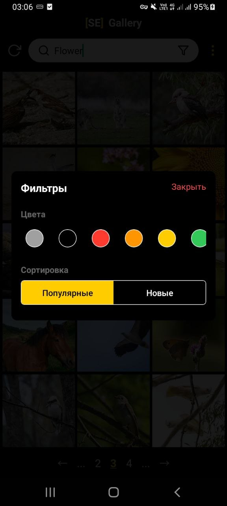
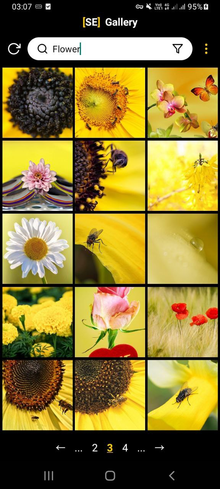
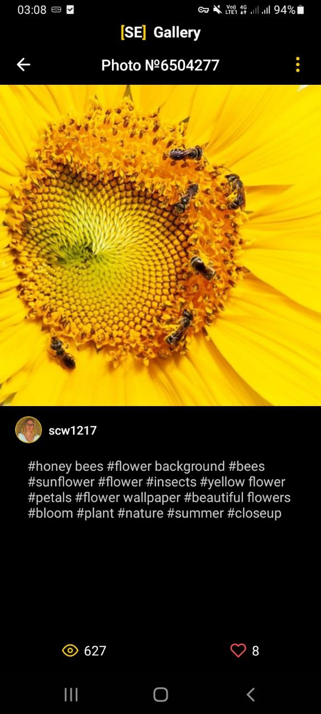

<p align="center">
  
</p>

<h1 align="center">[SE] Gallery - галлерея фотографий с Pixabay</h1>

<p align="center">
  Кросс-платформенное мобильное приложение для просмотра и фильтрации изображений. Поддержка поиска, фильтров по цвету и сортировки, а также отзывчивый и современный дизайн.
</p>

<p align="center">
  <a href="https://github.com/MaisLaufen/se-gallery/releases">
    
  </a>
</p>

<br/>

<p align="center">
  
  
  
</p>

---

## 🚀 Возможности

✨ Приложение предоставляет:

- 🔍 **Поиск** изображений по ключевым словам  
- 🎨 **Фильтрацию по цвету** и **сортировку**: популярные / новые  
- 📄 **Постраничную подгрузку** изображений (infinite scroll)  
- ⚙️ Поддержку **MobX** для управления состоянием  
- 📱 Адаптивный и современный **интерфейс**

---

## 📦 Установка

Вы можете установить приложение двумя способами:

### 📁 Способ 1 — Установка APK

1. Перейдите на вкладку [**Релизы**](https://github.com/MaisLaufen/se-gallery/releases/latest);  
2. Скачайте `.apk` файл последнего релиза;  
3. Установите его на Android-устройство или эмулятор.

---

### 💻 Способ 2 — Сборка вручную

1. Убедитесь, что у вас установлены все необходимые SDK и окружение;  
2. Клонируйте проект и установите зависимости:

   ```bash
   npm install
   npx react-native run-android
   ```
